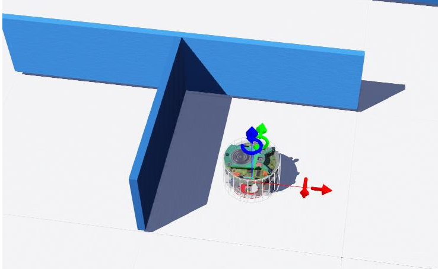

# Maze-Following Robot Using Search Algorithms
[](https://prezi.com/view/wHjIw9nZQi5z6kG3UhBq/)

This project demonstrates the design and simulation of an **autonomous maze-following robot** implemented in the **Webots simulation environment**.  
The robot combines **PID control** with **graph-based search algorithms (BFS and DFS)** to explore and solve maze structures intelligently.  
The control logic and algorithms were developed in **Python**, integrating motion control with real-time decision-making for stable and efficient navigation.

---

## 📘 Project Overview

The main goal of this project is to create a robot capable of autonomously exploring and navigating through a maze.  
Using **PID feedback control**, the robot maintains stable motion and precise turns, while **BFS** and **DFS** algorithms are used for **pathfinding** and **exploration**.

The entire system was modeled and tested in **Webots**, where we simulated both the robot’s kinematics and its decision-making process under realistic conditions.

---

## ⚙️ Key Features

- **PID Control for Motion Stability:**  
  A discrete-time PID controller regulates the robot’s wheel speeds and orientation, ensuring smooth and accurate movements.

- **BFS & DFS Path Planning:**  
  Implemented Breadth-First Search (BFS) and Depth-First Search (DFS) algorithms for intelligent maze traversal and route generation.

- **Webots Simulation:**  
  The complete robot model, environment, and control loop were built and tested in Webots for realistic visualization and debugging.

- **Autonomous Navigation:**  
  The robot combines control and logic layers, making local and global navigation decisions without human intervention.

---

## 🧩 System Components

- **`PID.py`:** Discrete PID controller implementation for real-time wheel control.  
- **`Maze_controller.py`:** Contains the BFS/DFS algorithms and decision-making logic for maze traversal.  
- **`Location.py`:** Tracks the robot’s position and updates during motion using Webots sensors and simulation feedback.  
---

## 📊 Simulation and Results

The robot was successfully tested in Webots under different maze configurations.  
PID control provided stability during motion, and BFS/DFS algorithms ensured complete and efficient maze coverage.

**Key Results:**
- Smooth and stable robot motion using PID feedback.  
- Successful maze-solving using BFS and DFS algorithms.  
- Accurate wall-following and recovery from dead-ends.  

### 🔹 Maze Simulation

*Simulation of the maze-following robot in Webots using PID and search algorithms.*

---

## 🚀 How to Run

1. Clone the repository:
   ```bash
   git clone https://github.com/amirasadi1681/Maze-Following-Robot.git
   cd Maze-Following-Robot
